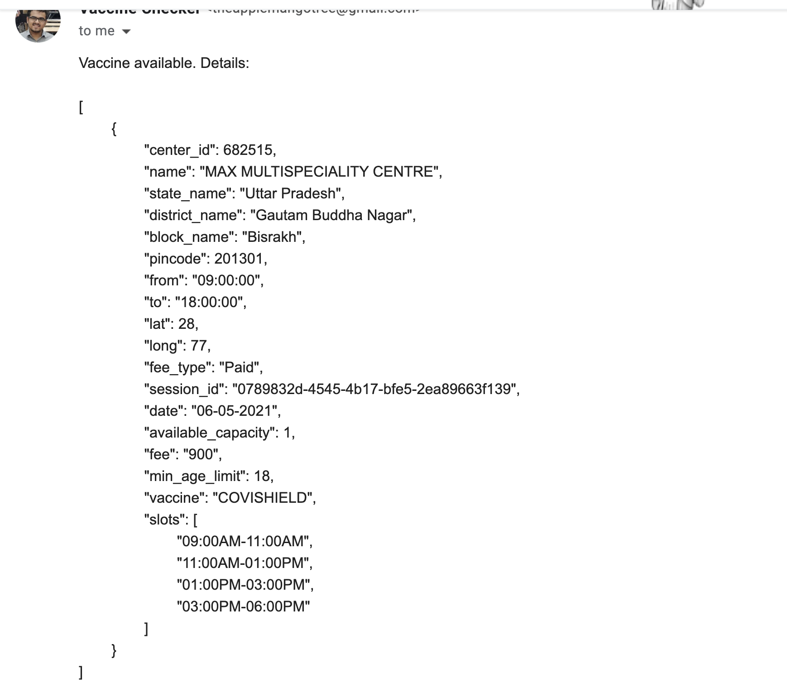

# VaccineNotifier
VaccineNotifier checks the CoWIN portal periodically to find vaccination slots available in your PIN code (or district) for your age. If found, it will send you emails as per the specified cron schedule until the slots are available. It is possible to search for multiple people at a time by specify their respective details in `find_entries.json` file.
\
\
Important: Please specify the cron schedule in `vaccineNotifier.js` responsibly in order to avoid bombarding the CoWIN servers with multiple requests.

 Steps to run the script:  

Step 1) Enable application access on your gmail with steps given here:
https://support.google.com/accounts/answer/185833?p=InvalidSecondFactor&visit_id=637554658548216477-2576856839&rd=1  
\
Step 2) Enter the details in the file `.env` present in the same folder.
\
\
Step 3) Add the entries for different people in `find_entries.json` file. For each person, below entries are needed.
`find_by`: either `district` or `pincode`\
`find_value`: value for a valid district_id or 6-digit PIN code (to find out your district_id, go to https://www.cowin.gov.in/home -> launch Network Inspector in your browser, under "Check your nearest vaccination center and slots availability", select your state and district and hit the "Search" button -> check the value sent as district_id in the calendarByDistrict API request)\
`age`: age in years\
`to_email`: a valid email address on which the email alerts are required to be sent.
\
\
Step 4) On your terminal run: `npm i && pm2 start vaccineNotifier.js`.
\
\
To close the app run: `pm2 stop vaccineNotifier.js && pm2 delete vaccineNotifier.js`.

Here's a sample of the resultant emails:

